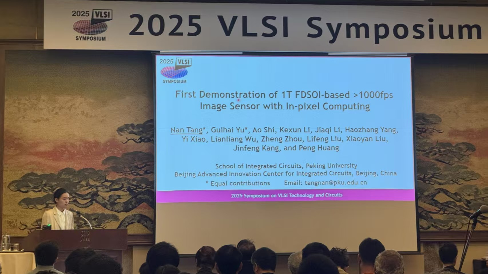

I am an <strong>assistant professor</strong> in the <strong>School of Integrated Circuits at Peking University</strong>. My research interests include <strong>emerging computing based on emerging devices</strong>, including the <strong>design and fabrication of emerging devices</strong>, the <strong>circuit and architecture design of RRAM-based CIM chips</strong>, and <strong>neuromorphic computing</strong>. I have authored <strong>over 100 scientific publications</strong> in leading international journals and conferences, such as <strong>Nature Electronics</strong>, <strong>Nature Communications</strong>, <strong>Science Advances</strong>, <strong>Advanced Materials</strong>, <strong>IEEE-IEDM</strong>, <strong>DAC</strong>, <strong>IEEE-TCAS</strong>, and <strong>IEEE-EDL</strong>. I am a recipient of the <strong>Excellent Young Scholars (NSFC 2020)</strong>, the <strong>Second Prize of Natural Science Award (Ministry of Education 2019)</strong>, and <strong>PhD Student Fellowship (IEEE EDS 2014)</strong>.

I am always looking for <strong>motivated undergraduate and graduate students</strong> with backgrounds in <strong>microelectronics</strong>, <strong>integrated circuits</strong>, <strong>computer science</strong>, <strong>electrical engineering</strong>, <strong>physics</strong>, or related areas working on research fields of:

1. **RRAM-based CIM chips and systems** for neural networks.
2. **Emerging devices and architectures** for data sensing, computing, and storage.
3. **Memristor-based neuromorphic computing**.
4. **Auto design tools** for emerging computing systems.

**Opening positions available: Ph.D., Post Doc, Master**

News
======

    

        

            
            
Celebrating our 2024 research group graduation!

        

        

            
            
Yiyang Chen presenting at 2024 IEDM.

        

        <!-- Add more slides here as needed -->
        

            
            
Latest research activities in our lab.

        

    

    
    <button class="carousel-nav carousel-prev" onclick="moveSlide(-1)">&#10094;</button>
    <button class="carousel-nav carousel-next" onclick="moveSlide(1)">&#10095;</button>
    
    

        
        
        
    

* Jul. 2025: Congratulations to Haozhang Yang and Shiyue Song on their successful doctoral degree graduation from our research group! Wishing them great success in their future careers.
* Jun. 2025: Paper is accepted to VLSI Technology and Circuits. Congratulations to Nan Tang and all the collaborators and sponsors.
* Apr. 2025: Paper is accepted to IEEE Transactions on Computers. Congratulations to Lixia Han and all the collaborators and sponsors.
* Mar. 2025: Paper is accepted to Japanese Journal of Applied Physics. Congratulations to Zhuohua Tang and all the collaborators and sponsors.
* Mar. 2025: Paper is accepted to IEEE-EDTM. Congratulations to Ruiqi Chen and all the collaborators and sponsors.
* Feb. 2025: Paper is accepted to Science China Information Sciences. Congratulations to Lixia Han and all the collaborators and sponsors.
* Dec. 2024: Paper is accepted to IEEE-TCAS-I. Congratulations to Yang Feng and all the collaborators and sponsors.
* Sep. 2024: Paper is accepted to IEDM. Congratulations to Yiyang Chen and all the collaborators and sponsors.
* Sep. 2024: Paper is accepted to IEEE-TCAS-I. Congratulations to Ao Shi and all the collaborators and sponsors.
* Jul. 2024: Congratulations to Lixia Han, Guihai Yu, and Ruiyi Li on successfully graduating with their doctoral degrees from our research group! Best wishes for your future endeavors.
* May. 2024: Paper is accepted to IEEE-ISCAS. Congratulations to Ao Shi and all the collaborators and sponsors.
* Mar. 2024: Paper is accepted to DATE. Congratulations to Lixia Han and all the collaborators and sponsors.
* Feb. 2024: Paper is accepted to Science Advances. Congratulations to Ruiqi Chen and all the collaborators and sponsors.
* Feb. 2024: Paper is accepted to Nature Communications. Congratulations to Yulin Feng and all the collaborators and sponsors.
* Jan. 2024: Paper is accepted to TCAD. Congratulations to Lixia Han and all the collaborators and sponsors.
* Jan. 2024: Paper is accepted to IEEE-EDL. Congratulations to Yiyang Chen and all the collaborators and sponsors.
